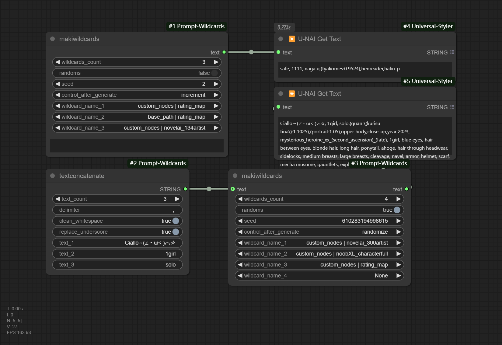

# ComfyUI-Prompt-Wildcards

ComfyUI中通过选项使用的Wildcards

[简体中文|[English](README.md)]

# 描述

通过选项的方式使用Prompt Wildcards。

类似于[stable-diffusion-webui-wildcards](https://github.com/AUTOMATIC1111/stable-diffusion-webui-wildcards)在ComfyUI中的用处，但不使用 `__name__`。

Wildcards文件夹位置：

* 在 ComfyUI 安装的根目录中创建一个名为 “wildcards” 的目录（/ComfyUI/wildcards）
* 本插件目录下的“wildcards”（/ComfyUI/custom_nodes/ComfyUI-Prompt-Wildcards/wildcards）



# 示例

.png)

## 安装

打开 `ComfyUI`根目录下的 `custom_nodes`：

```
git clone https://github.com/MakkiShizu/ComfyUI-Prompt-Wildcards.git
```

节点名称：

- utils/makiwildcards
- utils/textconcatenate

### 许可证

本项目遵循MIT许可证。

<hr>
