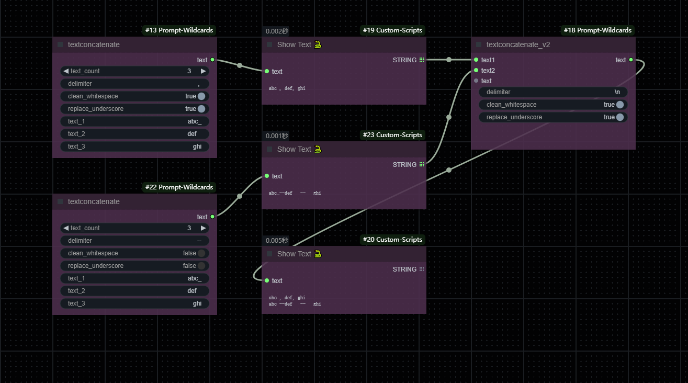

# ComfyUI-Prompt-Wildcards

Optional wildcards in ComfyUI

[[简体中文](README-zh.md)|English]

# Description

Using prompt wildcards through selection.

Similar to the role of [stable-diffusion-webui-wildcards](https://github.com/AUTOMATIC1111/stable-diffusion-webui-wildcards) in ComfyUI, but not used `__name__` .




**2025/03/20**: To ensure that under the same seed value, each distinct count retrieves different content even when using the same file, the randomization method for randoms was revised. Future implementations leveraging the same seed will now produce outputs divergent from those prior to this update (March 20, 2025).

Wildcards folder PATH:

* Create a directory in the root of your ComfyUI install called "wildcards" (ComfyUI/wildcards)
* The "wildcards"  in the directory of this plugin (/ComfyUI/custom_nodes/ComfyUI Prompt Wildcards/wildcards)

Nodes Parameter Explanation:

* **makiwildcards** :
  * **wildcards_count** : Select the number of wildcards to use.
  * **randoms** : Whether to keep the seed random. When set to `false`, it selects the row based on the seed value. `true` is for replicating the original content (this parameter was not added before 2025/1/8), meaning random rows.
  * **seed** : Random seed, used to select a row from the txt file based on the `randoms` mode.
  * **wildcard_name_{n}** : Select wildcard files.
  * **text** : The content here will be added before the wildcards, separated by commas.
* **makitextwildcards**:
  * The syntax of `randoms` and `seed` in this system mirrors their usage in `makiwildcards`. Here:
    - The `text` parameter specifies the textual content requiring randomization.
    - A specific line from the text is selected for output based on the combined values of `randoms` and `seed`, functioning identically to how wildcard systems parse and utilize line-based data from .txt files (e.g., similar to traditional wildcards).
* **textconcatenate** :
  * **text_count** : Select the number of texts to use.
  * **delimiter** : Separator.
  * **clean_whitespace** : Remove leading and trailing whitespace.
  * **replace_underscores** : Replace underscores with spaces.
  * **text_{n}** : Text content.

## Installation

Clone the repository to `custom_nodes`:

```
git clone https://github.com/MakkiShizu/ComfyUI-Prompt-Wildcards.git
```

node name：

- utils/makiwildcards
- utils/makitextwildcards
- utils/textconcatenate

### License

This project is licensed under the MIT License.

<hr>
