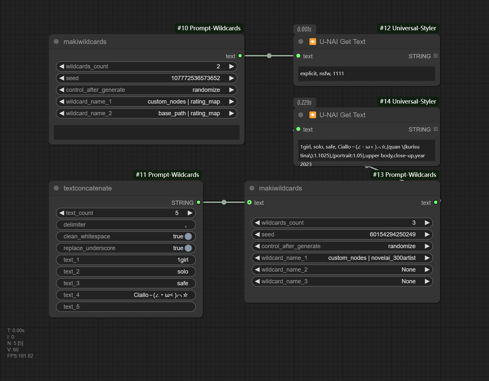

# ComfyUI-Prompt-Wildcards

Optional wildcards in ComfyUI

[[简体中文](README-zh.md)|English]

# Description

Using prompt wildcards through selection.

Similar to the role of [stable-diffusion-webui-wildcards](https://github.com/AUTOMATIC1111/stable-diffusion-webui-wildcards) in ComfyUI, but not used `__name__` .

Wildcards folder PATH:

* Create a directory in the root of your ComfyUI install called "wildcards" (ComfyUI/wildcards)
* The "wildcards"  in the directory of this plugin (/ComfyUI/custom_nodes/ComfyUI Prompt Wildcards/wildcards)

Nodes Parameter Explanation:

* **makiwildcards** :
  * **wildcards_count** : Select the number of wildcards to use.
  * **randoms** : Whether to keep the seed random. When set to `false`, it selects the row based on the seed value. `true` is for replicating the original content (this parameter was not added before 2025/1/8), meaning random rows.
  * **seed** : Random seed, used to select a row from the txt file based on the `randoms` mode.
  * **wildcard_name_{n}** : Select wildcard files.
  * **text** : The content here will be added before the wildcards, separated by commas.
* **textconcatenate** :
  * **text_count** : Select the number of texts to use.
  * **delimiter** : Separator.
  * **clean_whitespace** : Remove leading and trailing whitespace.
  * **replace_underscores** : Replace underscores with spaces.
  * **text_{n}** : Text content.

# Example



## Installation

Clone the repository to `custom_nodes`:

```
git clone https://github.com/MakkiShizu/ComfyUI-Prompt-Wildcards.git
```

node name：

- utils/makiwildcards
- utils/textconcatenate

### License

This project is licensed under the MIT License.

<hr>
